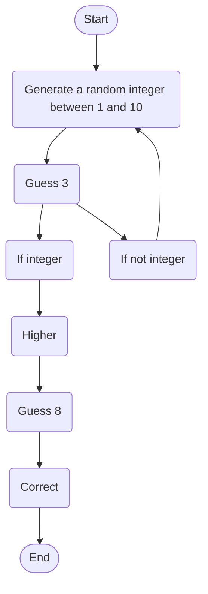

# Dlc1235.github.io 
Daniel Chiang
This is my waketech school account
This repository will hold all my school assighnemnts

# _About Me_
## **Personal Hobbies** 
Some of my Personal hobbies are that i enjoy playing computer games such as League of legends and Warframe.
I also enjoy building computers, reading Manwha, taking my dog on a walk and trying new foods.

### **Websites I Recommend**
[youtube](www.youtube.com) - Youtube is a quick and easy way to find videos on almost anything you could think of. I personally use youtube just about everyday.
 [amazon](www.amazon.com) - Amazon provides a hub of thousands of items that can be purchased and quickly shipped directly to your residence. Amazon is the biggest ecommerce website in the world.

# **Guessing.md**
This is my lab 2 guessing game using mermaid to visually show how it works.

User starts game then chooses a integer between 1 and 10. The User chooses the integer 3 and the game continues. If the user does not choose a integer then the game will restart. If the users guess was to low the user must choose a higher integer. If the user chooses the correct number then the game ends.
